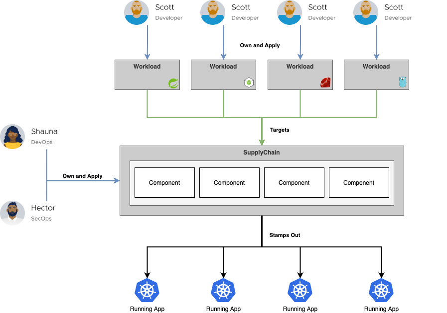

## TL;DR

Cartographer is a
[Supply Chain Choreographer](https://tanzu.vmware.com/developer/guides/ci-cd/supply-chain-choreography/) for Kubernetes.
It allows App Operators to create pre-approved paths to production by integrating Kubernetes resources with the elements
of their existing toolchains (e.g. Jenkins).

**Each** pre-approved supply chain creates a paved road to production; orchestrating supply chain resources - test,
build, scan, and deploy - allowing developers to be able to focus on delivering value to their users while also
providing App Operators with the peace of mind that all code in production has passed through all of the steps of an
approved workflow.

## Cartographer Design and Philosophy

Cartographer allows users to define all of the steps that an application must go through to create an image and
Kubernetes configuration. Users achieve this with the Supply Chain abstraction, see
[Spec Reference](reference/workload#clustersupplychain).

The supply chain consists of resources that are specified via Templates. Each template acts as a wrapper for existing
Kubernetes resources and allows them to be used with Cartographer. There are currently four different types of templates
that can be use in a Cartographer supply chain:

- [Source Template](reference/template#clustersourcetemplate)
- [Image Template](reference/template#clusterimagetemplate)
- [Config Template](reference/template#clusterconfigtemplate)
- [Generic Template](reference/template#clustertemplate)

Contrary to many other Kubernetes native workflow tools that already exist in the market, Cartographer does not “run”
any of the objects themselves. Instead, it monitors the execution of each resource and templates the following resource
in the supply chain after a given resource has completed execution and updated its status.

Cartographer assumes that objects are managed by a controller that implements a control loop; objects are
created with a desired state and a controller moves the cluster closer to the desired state. For most Kubernetes objects
this includes the ability to update the desired state, to update the spec of an object, and have the controller move the
cluster toward the new desired state. Cartographer manages resources that do not follow this pattern by implementing an
[immutable pattern](lifecycle); rather than updating an object a new object will be created. This enables the inclusion
of a number of CI/CD Kubernetes resources including Tekton.

While the supply chain is operator facing, Cartographer also provides an abstraction for developers called
[workloads](reference/workload#workload). Workloads allow developers to create application specifications such as the
location of their repository, environment variables and service claims.

By design, supply chains can be reused by many workloads. This allows an operator to specify the steps in the path to
production a single time, and for developers to specify their applications independently but for each to use the same
path to production. The intent is that developers are able to focus on providing value for their users and can reach
production quickly and easily, while providing peace of mind for app operators, who are ensured that each application
has passed through the steps of the path to production that they’ve defined.

